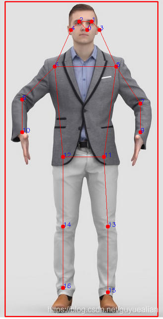
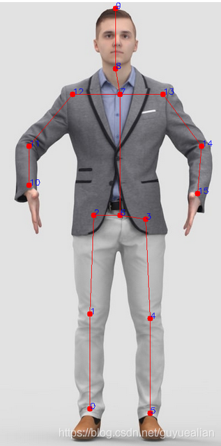

# 关键点示意图
## 1. Dataset

#### (1) COCO数据集

- 下载地址： https://cocodataset.org/#download
- 解压后，并保存如下的文件结构

```
COCO
├── train2017
│     ├── annotations
│     │       ├── instances_train2017.json
│     │       └── person_keypoints_train2017.json
│     └── images
│              ├── 000000001.jpg
│              ├── 000000002.jpg
│              ├── 000000003.jpg
└── val2017
      ├── annotations
      │        ├── instances_val2017.json
      │        └── person_keypoints_val2017.json
      └── images
                ├── 000000001.jpg
                ├── 000000002.jpg
                ├── 000000003.jpg
```

- 修改配置文件的数据根目录，如[train_model_mbv2_penson.yaml](configs/coco/mobilenet/train_model_mbv2_penson.yaml)
- 其他配置文件，也可以如下修改

```yaml
DATASET:
  DATASET: 'person_coco'
  ROOT: '/path/to/yours/dataset/COCO'  
```

#### (2) MPII数据集

- 下载地址： http://human-pose.mpi-inf.mpg.de/#download
- 原始数据集的标注是Matlab格式，使用前需要转换json格式:
  下载地址： [GoogleDrive](https://drive.google.com/drive/folders/1En_VqmStnsXMdldXA6qpqEyDQulnmS3a)
- 解压后，并保存如下的文件结构

```
MPII
├── annot
│     ├── gt_valid.mat
│     ├── test.json
│     ├── train.json
│     ├── trainval.json
│     └── valid.json
└── images
       ├── 000000001.jpg
       ├── 000000002.jpg
       ├── 000000003.jpg
```

- 修改配置文件的数据根目录，如[train_model_mbv2_penson.yaml](configs/mpii/mobilenet/train_model_mbv2_penson.yaml)
- 其他配置文件，也可以如下修改

```yaml
DATASET:
  DATASET: 'custom_mpii'
  ROOT: '/path/to/yours/dataset/MPII'  
```

#### (3) 关键点

- MPII关键点

```
FLIP_PAIRS: [ [ 0, 5 ], [ 1, 4 ], [ 2, 3 ], [ 10, 15 ], [ 11, 14 ], [ 12, 13 ] ]
SKELETON: [ [ 0, 1 ], [ 1, 2 ], [ 3, 4 ], [ 4, 5 ], [ 2, 6 ], [ 6, 3 ], [ 12, 11 ], [ 7, 12 ],[ 11, 10 ], [ 13, 14 ], [ 14, 15 ], [ 8, 9 ], [ 8, 7 ], [ 6, 7 ], [ 7, 13 ] ]

{
  0: "r_ankle",
  1: "r_knee",
  2: "r_hip",
  3: "l_hip",
  4: "l_knee",
  5: "l_ankle",
  6: "pelvis",
  7: "thorax",
  8: "upper_neck",
  9: "head_top",
  10: "r_wrist",
  11: "r_elbow",
  12: "r_shoulder",
  13: "l_shoulder",
  14: "l_elbow",
  15: "l_wrist"
}

```

- COCO关键点

```
FLIP_PAIRS: [ [ 1, 2 ], [ 3, 4 ], [ 5, 6 ], [ 7, 8 ], [ 9, 10 ], [ 11, 12 ], [ 13, 14 ], [ 15, 16 ] ]
SKELETON: [ [ 15, 13 ], [ 13, 11 ], [ 16, 14 ], [ 14, 12 ], [ 11, 12 ], [ 5, 11 ], [ 6, 12 ], [ 5, 6 ], [ 5, 7 ],[ 6, 8 ], [ 7, 9 ], [ 8, 10 ], [ 0, 1 ], [ 0, 2 ], [ 1, 3 ], [ 2, 4 ] ]

{
  0: "nose",
  1: "left_eye",
  2: "right_eye",
  3: "left_ear",
  4: "right_ear",
  5: "left_shoulder",
  6: "right_shoulder",
  7: "left_elbow",
  8: "right_elbow",
  9: "left_wrist",
  10: "right_wrist",
  11: "left_hip",
  12: "right_hip",
  13: "left_knee",
  14: "right_knee",
  15: "left_ankle",
  16: "right_ankle"
}
```

|  数据集  |                     COCO                        |                  MPII                            |
|:--------:|:-----------------------------------------------:|:------------------------------------------------:|
|  关键点  |  |   |
