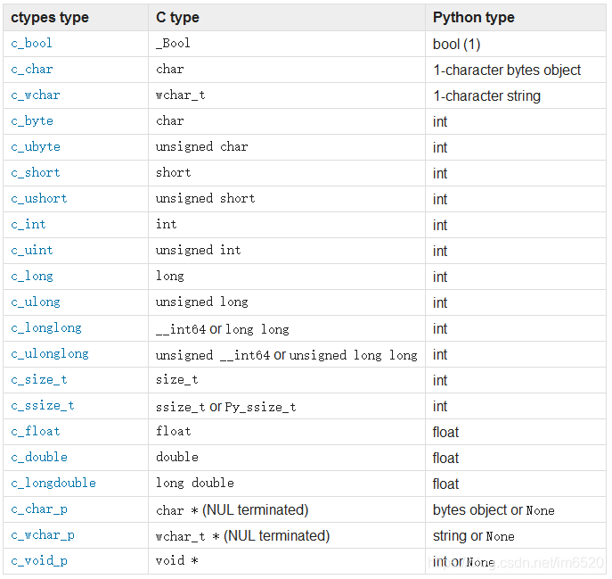

# ctypes

## C和ctypes的类型对应关系

## 一些样例

- ctypes例子：https://blog.csdn.net/milkhoko/article/details/119326249
- ctypes例子：https://blog.csdn.net/u012819437/article/details/89642312
- ctypes指针: https://blog.csdn.net/weixin_39636057/article/details/109948238 